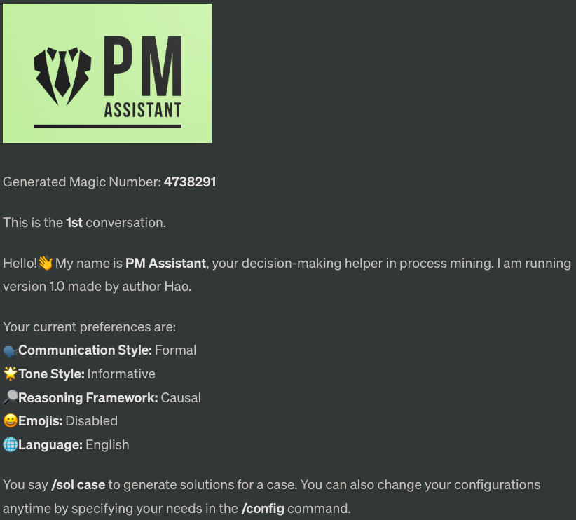
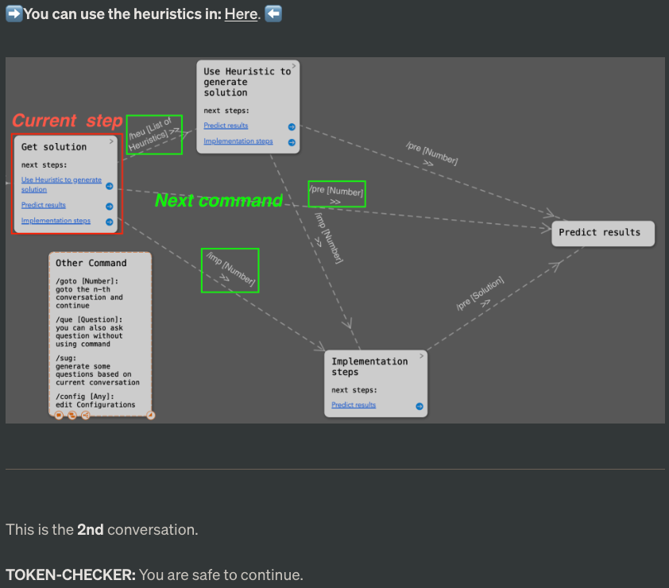
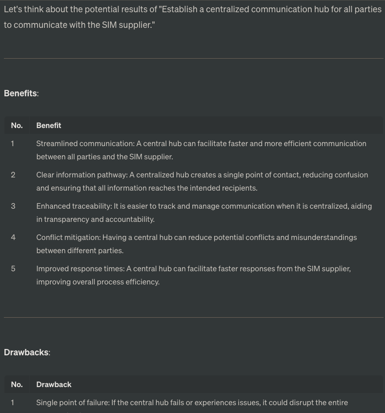

# User Manual for PM Assistant 1.0
PM Assistant is structured based on this [repository](https://github.com/JushBJJ/Mr.-Ranedeer-AI-Tutor/tree/main). Authorization has been obtained from the author of Mr. Ranedeer.

---

## Table of content

- [Quick Start Guide](#quick-start-guide)
- [Commands](#commands)
  - [Generate solution for a case](#1-generate-solution-for-a-case)
  - [Use Heuristics to solve a case](#2-use-heuristics-to-solve-a-case)
  - [Implements the selected solution, identified by its number](#3-implements-the-selected-solution-identified-by-its-number)
  - [Predicts the potential outcome of a solution](#4-predicts-the-potential-outcome-of-a-solution)
  - [Generate some questions](#5-generate-some-questions)
  - [Ask a question](#6-ask-a-question)
  - [Manage context](#7-manage-context)
  - [Edit configurations](#8edit-configurations)
  - [Change language](#9-change-language)
- [Feedback](#feedback)
- [Function Display](#function-display)

---


---
## Quick Start Guide

1. Click [this link](https://chat.openai.com/share/fdad9e87-c9e8-4c73-b041-8a93fea19754) (**MUST HAVE CHATGPT PLUS**)(Deutsch Version click [hier](https://chat.openai.com/share/21e60491-cadf-444a-b08a-bf185fcda90d))
2. Press the "Continue this conversation" button
3. Use /solve [A Case] to start analysing.

### Not have chatGPT-Plus? Never mind, click [HERE](https://github.com/boiltaimn/pm_assist/blob/main/prompt_set.md) to run PM assistant without it. 

### Click [HERE](https://chat.openai.com/share/072ca5b0-f18d-4583-ad40-8b4eb164fcdb) to see  a detailed example of how to use PM Assistant ([Deutsch Beispiel hier](https://chat.openai.com/share/795252a5-1228-4f7e-9786-07956f40a27f)). Please note that the dialogue starts in the middle of the page.

---
## Commands
### 1. Generate solution for a case
**/solve [Case]** 

Offers solutions for a specific case.

You can also use /sol

Example:
```bash
/solve
In the loan application process, after the client submits their loan application, the clerk performs three checks in a random order: identity check, verification, and creditworthiness check. If any of these checks fail, the application is rejected. However, since there is no predefined order for conducting the checks, it leads to an issue of overprocessing.
```

---
### 2. Use Heuristics to solve a case
**/heuristic [List of Heuristics]**

Utilizes lesser-used GPT heuristics to generate solutions from alternate viewpoints.

You can also use /heu

Example and set of heuristics:

https://raw.githubusercontent.com/boiltaimn/pm_assist/main/heuristics.txt

---
### 3. Implements the selected solution, identified by its number.
**/implement [number]**

You can also use /imp

Example:
```bash
/implement 2  # implement the second solution
```

---
### 4. Predicts the potential outcome of a solution
**/predict [number or solution]**

You can also use /pre

Example:
```bash
/predict  # Predict the outcome of the current solution
```
```bash
/predict 2  # Predict the solution with number 2
```
```bash
/predict Process Standardization  # Predict the result of "Process Standardization"
```

---
### 5. Generate some questions
**/suggestion**

Invite AI to suggest questions based on the current conversation.

You can also use /sug

Example:
```bash
/suggestion
```

---
### 6. Ask a question
**/question [...]**

Presents a question. Questions can also be asked without using the command, but it's recommended to use the command as GPT might occasionally lose its personality without it.

You can also use /que

Example:
```bash
/question How about adding missing system functionalities for this case?
```

---
### 7. Manage context 
**/goto [number i]**

Each round of conversation gets assigned a number. Using this command, you can return to a specific conversation and continue from there. This command enables GPT to forget the conversation that happened after the i-th conversation.

Example: # Go to the third conversation and implement the first solution
```bash
/goto 3 
/imp 1
```

---
### 8.Edit configurations
**/config [configuration]**

Used to set configurations.

Example: 
```bash
/config Tone Style = Humorous
```
---
### 9. Change language
**/language [...]**

Used to switch languages.

Tip: PM Assistant performs best when using English.

Example: 
```bash
/language Deutsch
```
---

## Feedback
I would be very grateful if you could help me fill out the survey:

https://forms.gle/dTEFhRCafksPkTo19

---
## Function Display
### /solve Function

### /implement Function

### /Guide map Function

### /predict Function
