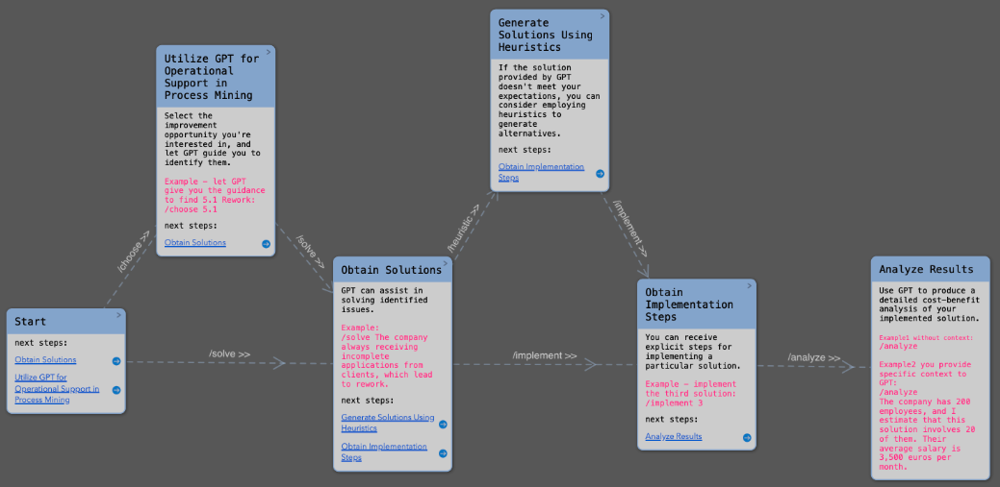
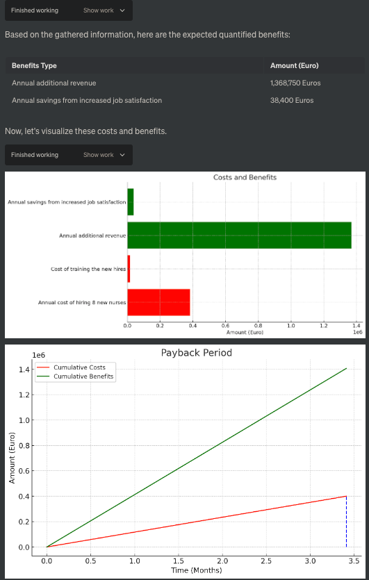
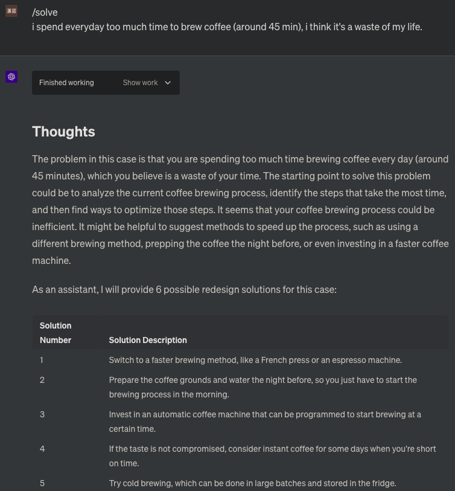
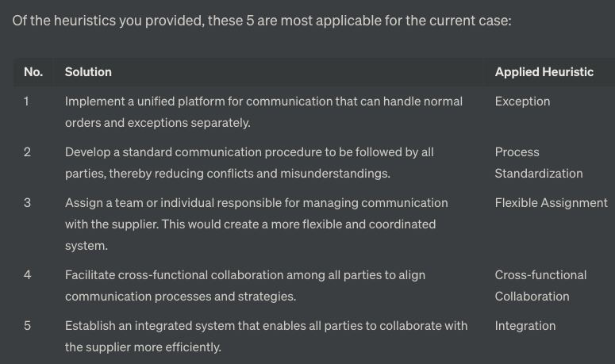
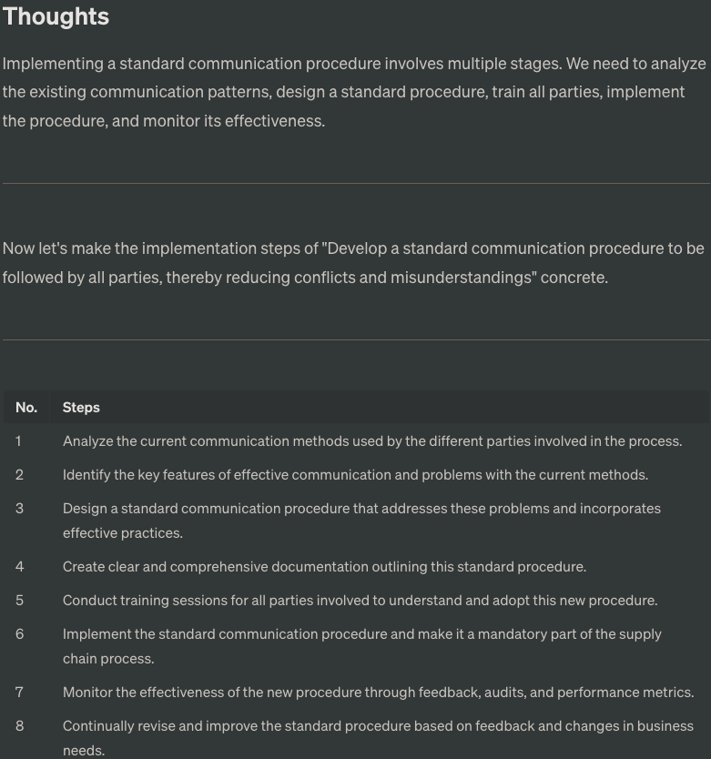
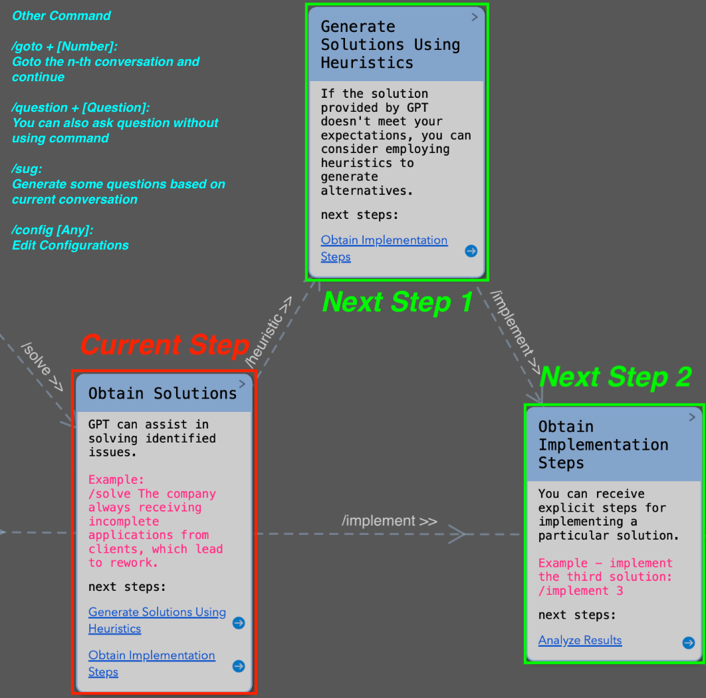

# User Manual for Process Mining Assistant 1.1
PM Assistant is structured based on this [repository](https://github.com/JushBJJ/Mr.-Ranedeer-AI-Tutor/tree/main). Authorization has been obtained from the author of Mr. Ranedeer.

---

## Table of content
- [Why PM Assistant](#why-process-mining-assistant)
- [Quick Start Guide](#quick-start-guide)
- [Core Commands](#core-commands)
  - [Operational support in process mining](#1-operational-support-in-process-mining)
  - [Generate solution for a case](#2-generate-solution-for-a-case)
  - [Get actionable steps for a selected solution](#3-get-actionable-steps-for-a-selected-solution-identified-by-its-number)
  - [Cost-Benefit analysis and visualization](#4-cost-benefit-analysis-and-visualization)
- [A Detailed Example](#a-detailed-example)
- [Other Commands](#other-commands)
  - [Use heuristics to solve a case](#5-use-heuristics-to-solve-a-case)
  - [Generate some questions](#6-generate-some-questions)
  - [Ask a question](#7-ask-a-question)
  - [Manage context](#8-manage-context)
  - [Edit configurations](#9-edit-configurations)
  - [Change language](#10-change-language)
- [Feedback](#feedback)
- [Function Display](#functions-display)

---


---
## Why Process Mining Assistant

Process Mining Assistant is designed to assist the redesign part of process mining.

It could empower you in several ways:

1. **Operational Support in Process Mining:** For specified improvement opportunities, the Assistant can provide operational support for the software you use, helping you to discover them using the software.

2. **Solution Generation:** For improvement opportunities identified in process mining, PM Assistant allows you to rapidly generate multiple solutions.

3. **Actionable Steps:** Based on these solutions, the tool is capable of generating concrete implementation steps.

4. **Cost-Benefit Analysis and Visualization:** The Assistant can calculate the estimated costs and potential returns for a detailed implementation plan, and use visualization to help you understand the results.

An exciting discovery we've made is that PM Assistant is not only capable of supporting the redesigning needs in process mining, but it can also provide practical solutions, implementation steps, and thoughtful trade-offs for everyday problems you might encounter in life. PM Assistant - a tool designed for process mining, but its utility extends well beyond!

### Example from life:


---

## Quick Start Guide

[//]: # ([1. Click **[this link]&#40;https://chat.openai.com/share/858e2760-3606-4077-8e7e-28615126812c&#41;** &#40;**MUST HAVE CHATGPT PLUS**&#41;&#40;Deutsch Version click **[hier]&#40;https://chat.openai.com/share/25ec0afb-5070-46b7-b002-98126d4f24bc&#41;**&#41;)

[//]: # ()
[//]: # (2. Press the "Continue this conversation" button)

[//]: # ()
[//]: # (3. Use /choose + [Number] to get operational support to mine specified opportunity, or /solve + [A Case] to start analysing.]&#40;&#41;)


Please follow the steps to use the prompt:
1. Copy the whole prompt from **[here](https://raw.githubusercontent.com/finsterniz/pm_assist/main/pm_assist.txt)**,
2. Open ChatGPT, select GPT-4 model,
3. Paste the prompt copied in step 1 into the dialogue and press Enter to load the prompt.

## Video-Tutorial in Youtube: https://www.youtube.com/watch?v=Wg3baXoeu8A

[//]: # (Click [here]&#40;https://chat.openai.com/share/b7d99083-add1-4f61-b61d-c2678b53bfe9&#41; to see  a detailed example of how to use PM Assistant &#40;[Deutsch Beispiel hier]&#40;https://chat.openai.com/share/aee36a56-4bf2-4c72-abe6-6cc6fc21b9d8&#41;&#41;. Please note that the dialogue starts in the middle of the page.)

---
## Core-Commands

### 1. Operational Support in Process Mining
**/choose + [Number of Improvement Opportunity]**

This command is used to let GPT provide operational guidance to find an improvement opportunity in the selected software. 


You can also use its abbreviation "/cho"

Example: let GPT give you the guidance to find 5.1 Rework
```
/choose 5.1
```

### 2. Generate solution for a case/issue
**/solve + [case/issue]**

This command is used to get solutions for an issue found in process mining software. Could also be used to solve all kinds of problems such as everyday problems.

Offers solutions for a specific case.

You can also use its abbreviation "/sol"

Example in process mining:
```bash
/solve
In the loan application process, after the client submits their loan application, the clerk performs three checks in a random order: identity check, verification, and creditworthiness check. If any of these checks fail, the application is rejected. However, since there is no predefined order for conducting the checks, it leads to an issue of overprocessing.
```

Example in everyday problems:
```bash
/solve
I spend everyday too much time to brew coffee, which is a waste of life.
```

---
### 3. Get actionable steps for a selected solution, identified by its number.
**/implement + [number]**

This command is used to get actionable steps for a solution.

You can also use its abbreviation "/imp"

Example: implement the second solution
```bash
/implement 2
```

---
### 4. Cost-Benefit Analysis and Visualization
**/analyze + [some context]**

This command is used to generate a quantitative analysis of a solution based on the implementation steps. 

You can also use its abbreviation "/ana"

Example 1: Analyse without providing initial context
```bash
/analyze
```
Example 2: Analyse with some initial context
```bash
/analyze  The company has 200 employees, and I estimate that this solution involves 20 of them. Their average salary is 3,500 euros per month.
```

---
## A detailed example


---
## Other commands

### 5. Use Heuristics to solve a case
**/heuristic + [List of Heuristics]**

Utilizes lesser-used GPT heuristics to generate solutions from alternate viewpoints.

You can also use /heu

Example and set of heuristics:

https://raw.githubusercontent.com/boiltaimn/pm_assist/main/heuristics.txt

### 6. Generate some questions
**/suggestion**

Invite GPT to suggest next command or questions based on the current conversation.

You can also use /sug

Example:
```bash
/suggestion
```

---
### 7. Ask a question
**/question + [...]**

Presents a question. Questions can also be asked without using the command, but it's recommended to use the command as GPT might occasionally lose its personality without it.

You can also use /que

Example:
```bash
/question How about adding missing system functionalities for this case?
```

---
### 8. Manage context 
**/goto + [number i]**

Each round of conversation gets assigned a number. Using this command, you can return to a specific conversation and continue from there. This command enables GPT to forget the conversation that happened after the i-th conversation.

Example: # Go to the third conversation and implement the first solution
```bash
/goto 3 
/imp 1
```

---
### 9. Edit configurations
**/config + [configuration]**

Used to set configurations.

Example: 
```bash
/config Tone Style = Humorous
```
---
### 10. Change language
**/language + [your language]**

Used to switch languages.d

Tip: PM Assistant performs best when using English.

Example: 
```bash
/language Deutsch
```
---

## Feedback
I would be very grateful if you could help me fill out the survey:

**[Questionnaire for LinkedIn](https://forms.gle/q5oFGDQUNL3CGtUU6)**

---
## Functions Display
### /choose Function

### /solve Function

### /heuristic Function

### /implement Function

### /analyze Function

### Guide map Function

