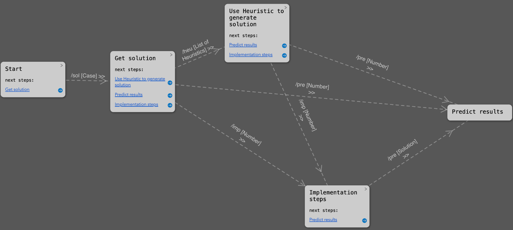

# A series of prompts to support PM decision-making

### A concrete example please click [here](https://chat.openai.com/share/1615a842-35f0-4cf5-b72a-d9312bc7499e).

---
## Table of Contents

[Functions](#functions)
   - [1. /solve: Generate solution for a case](#1-solve-generate-solution-for-a-case)
   - [2. /heuristic: Use Heuristics to solve a case](#2-heuristic-use-heuristics-to-solve-a-case)
   - [3. /implement: Implements the selected solution, identified by its number](#3-implement-implements-the-selected-solution-identified-by-its-number)
   - [4. /predict: Predicts the potential outcome of a solution](#4-predict-predicts-the-potential-outcome-of-a-solution)

[Questionnaire](#2-questionnaire)

---
## Guide map


---
## Functions
### A concrete example of all functions please click [here](https://chat.openai.com/share/1615a842-35f0-4cf5-b72a-d9312bc7499e).

### 1. /solve: Generate solution for a case

You need to fill the [case].

code:
```bash
/solveYou are a process mining expert, your task is to provide some possible redesign ideas based on CASE, please follow the EXAMPLE below, and give some redesign ideas for the CASE I gave.
---
[EXAMPLE.CASE]
In a university registrar’s office processes, employee manually enters students’ data into the system. Which lead to long processing times.
[EXAMPLE.SOLUTION]
The main problem appears to be the manual entry. This process is likely causing significant delays due to the laborious nature of manual data entry. The solution should focus on improving the efficiency of the data entry process. I will provide 6 possible redesign solutions for this case:
1. Implement an automated data entry system that can quickly process and upload large quantities of student data.
2. Use Optical Character Recognition (OCR) technologies to digitize physical student documents.
3. Train employees in the use of data entry software, thus reducing errors and increasing speed.
4. Establish a student self-service portal where students can enter their own data, reducing the workload on office staff.
5. Outsource the data entry process to a company that specializes in this field.
---
CASE
[case]
```

---
### 2. /heuristic: Use Heuristics to solve a case

Utilizes lesser-used GPT heuristics to generate solutions from alternate viewpoints.

You don't need to fill anything, but use this prompt after /solve.

code:

```bash
Now you need to read some heuristics and determine which 5 of them are most applicable for the case.
---
LIST OF HEURISTIC
- Exception: Prioritizes typical orders and isolates exceptions to maintain normal operations.
- Flexible assignment: Maximizes future flexibility by intelligent task assignment among resources.
- Outsourcing: Enhances efficiency by delegating certain processes to third parties.
- Parallelism: Reduces process time by performing tasks in parallel.
- Knock-out: Orders tasks by effort and termination likelihood, allows early process termination if conditions aren't met.
- Customer Teams: Creates diverse teams to handle specific orders, improving operational flexibility.
- Trusted party: Leverages third-party assessments or information, saving verification efforts.
- Resequencing: Optimizes task execution by intelligent reordering, reducing setup times.
- Integration: Enhances production efficiency through collaboration with customers or suppliers.
- Buffering: Subscribes to external updates for immediate information availability.
- Task composition or decomposition: Enhances work quality and reduces setup times by smart task composition or decomposition.
- Control relocation: Moves checks and reconciliation to the customer side to simplify business operations.
- Order-based work: Speeds up order processing by eliminating batch-processing and periodic activities.
- Split Responsibilities and Numerical Involvement: Simplifies coordination and minimizes conflicts by reducing involved parties.
- Case Manager: Dedicates one person for each order type focusing on process management.
- Empower: Accelerates decision-making by granting more authority to workers.
- Order assignment: Improves service quality by letting workers handle as many steps as possible for an order.
- Order types: Differentiates tasks based on order type to potentially establish new processes.
- Contact reduction: Enhances efficiency by limiting the number of contacts.
- Triage: Aligns tasks with resource capabilities and order requirements.
- Workload Management: Optimizes productivity and avoids burnout by effective task distribution.
- Process Standardization: Ensures operational efficiency and consistency through standardized processes.
- Cross-functional Collaboration: Promotes teamwork across different departments towards a shared goal.
---
TASK
1. Write your instructions to yourself on What is the problem of this case, which 5 heuristics most applicable for solving this problem.
2. Generate solutions with each of the 5 heuristic. Output solutions with number and applied heuristic in a markdown table format.
```

---
### 3. /implement: Implements the selected solution, identified by its number.

You need to fill the [Solution].

code:
```bash
TASK
1 think about What conditions or steps need to be met if [Solution] is to be put into practice.
2 please provide concrete details on how to implement it?(output steps with number in a markdown table format)
```

---
### 4. /predict: Predicts the potential outcome of a solution

You need to fill the [Solution].

code:
```bash
Let's think about the potential results of [Solution].
---
TASK
1. output benefits with in a markdown table format.
2. output drawbacks with in a markdown table format.
```

## 2. Questionnaire
Your feedback, especially any suggestions for improvement, would be invaluable to my project. 

You can Click [here](https://forms.gle/dTEFhRCafksPkTo19) to provide your precious feedback.
